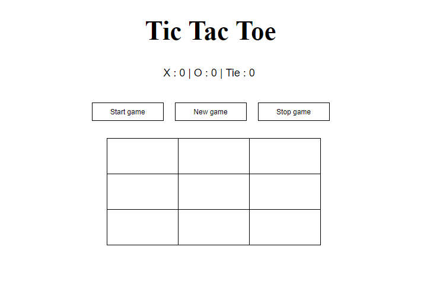
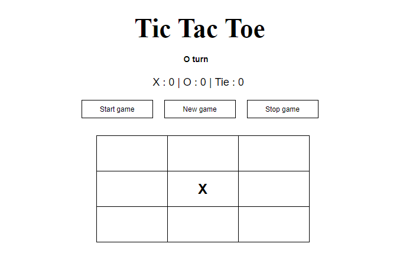
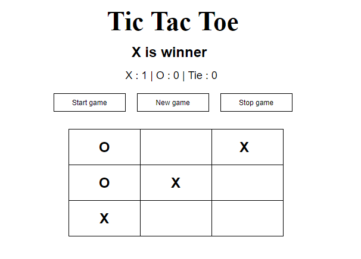

# Tic-Tac-Toe

# Project idea

The project idea is about a tic tac toe game that allows two players to play with them on the same device, who turns click x or o on board. If a player clicked on three squares in a diagonal, horizontal, or vertical row will winner. 

# List technologies used
- HTML
- CSS
- jQuery
- Java Script
- GitHub

# Development process and problem-solving strategy
I used some process as: 
- functions
- if conditions
- jQuary methods

# User Stories
- As a user, I should be able to start a new tic tac toe game
- As a user, I should be able to click on a square to add X first and then O, and so on
- As a user, I should be shown a message after each turn for if I win, lose, tie or who's turn it is next
- As a user, I should not be able to click the same square twice
- As a user, I should be shown a message when I win, lose or tie
- As a user, I should not be able to continue playing once I win, lose, or tie
- As a user, I should be able to play the game again without refreshing the page

# Wareframe
- Home page:

- After start game :

- If When a one from players wins

# How to use?

# URL the game

https://amanialosaimi.github.io/Tic-Tac-Toe/
